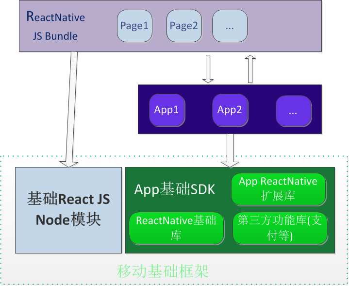

 
<!-- TOC -->

- [1. React Hybrid移动基础框架 - 概述](#1-react-hybrid移动基础框架---概述)
    - [1.1. 为什么需要基础框架？](#11-为什么需要基础框架)
    - [1.2. 基础框架包含什么？](#12-基础框架包含什么)
    - [1.3. 为什么要包含ReactNative基础库?](#13-为什么要包含reactnative基础库)
    - [1.4. 架构介绍](#14-架构介绍)

<!-- /TOC -->
# 1. React Hybrid移动基础框架 - 概述
## 1.1. 为什么需要基础框架？
主要是为了将项目中基础模块抽离出来，以基础SDK的形式来开发和维护，这样做的好处有：
* 模块独立性和规范性更强，对模块开发和使用人员都会形成约束，提高开发效率
* 增加代码的复用性和可移植性
* 在不影响客户项目的情况下，对一些基础模块做持续的优化改进

总之，基础框架可以沉淀React Hybrid 已有的移动开发成果，并以产品的形式做迭代开发演进
 
React Hybrid移动基础框架跟传统的又有所不同，它是围绕ReactNative这个核心来展开的。

## 1.2. 基础框架包含什么？
目前主要包括：
* `Android和IOS的ReactNative基础库`
* `原生工程运行所需的ReactNative基础实现和RCT控件`
* `ReactNative JS node基础模块`
* 原生的基础架构代码和基础控件
* 集成第三方的SDK，主要包括支付，推送，分享等

## 1.3. 为什么要包含ReactNative基础库?
为什么不直接使用Facebook所提供的ReactNative基础库呢？我们将ReactNative基础库集成到移动基础框架，主要是基于如下几点考虑的：
* Facebook ReactNative基础库相对来说集成不方便，特别是对已有项目的改造
* 便于对ReactNative基础库做自定义修改

## 1.4. 架构介绍
下面是基础框架的架构设计图
 
 

简单说明：
* 基于基础React JS module实现并打包ReactNative JS bundle
* 任何集成了App基础SDK的App都可以加载运行ReactNative JS bundle

具体的集成细节和开发文档详见相关章节
