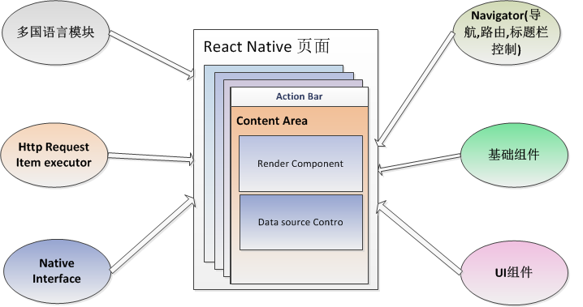

# 框架RN部分架构设计

 
从图中可以看出，主要有六个模块支撑业务线RN页面的开发运行：
* Navigator - 导航模块， 主要提供RN页面的注册，路由，导航以及标题栏控制
* 基础组件 - 包含AppConfig, Localstorage, utils等基础模块
* 业务线UI组件 - 包含业务线RN页面开发所需的各种UI控件模块
* 多国语言模块 - 供页面实现对多国语言的支持
* Http Request Executor - 网络请求执行模块，对于RN页面执行过程中的所有网络请求必须一一封装到RequestItem中，然后交于该模块执行，最后将执行结果回调
* Native Interface - RN和原生应用通讯模块，RN可以以命令的形式给原生发送数据，原生在收到并处理后，再将结果回调

以上模块对应的接口介绍详见后续相关章节
